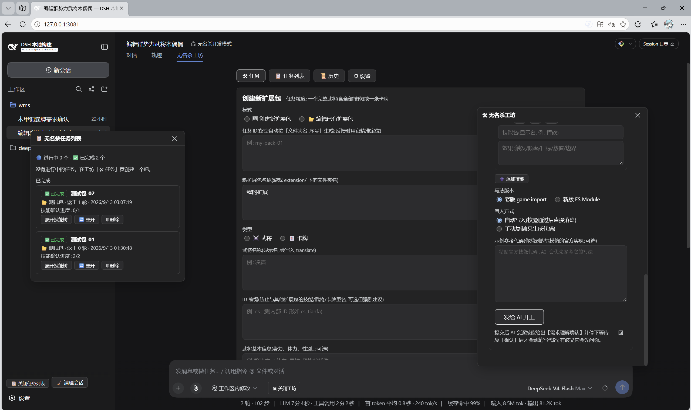
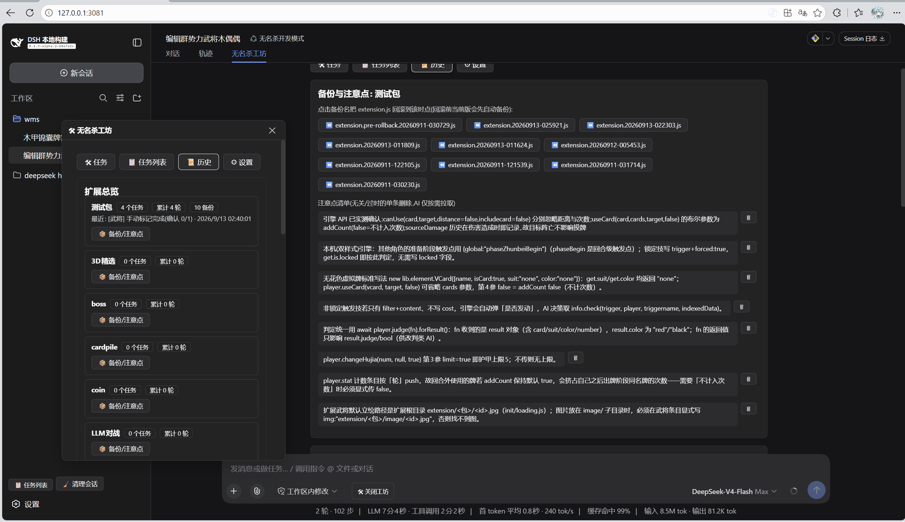

# dsh-noname-kit

无名杀扩展开发工坊,一个 DeepSeek Harness 插件。

让 AI 按规范写无名杀(Noname)的武将技能和卡牌扩展:规范注入、官方源码搜索、
静态校验、任务管理都有插件兜底;游戏扩展目录只认专用写入通道,AI 抄错或删错
代码会被工具层拦下,覆盖前自动备份。





## 安装

需要 DeepSeek Harness 和 pnpm。

```sh
dsh plugin --profile web add qtaik/dsh-noname-kit
```

装完再把「无名杀开发模式」preset 装上(在插件目录里执行):

```sh
node scripts/install-preset.mjs
```

## 配置

重启 `dsh web` 后打开 Web UI。工坊页里没配游戏目录会先出初始化向导:填无名杀
本体目录(含 extension/ 的那层,比如 `D:\Games\noname\resources\app`),或者点
「自动扫描」。配置保存在 `~/.dsh/noname-kit.json`,之后随时可以在工坊「⚙ 设置」
页改。

不配置也能用:写入方式选「手动复制」,AI 只生成代码不落盘。

## 使用

新建会话时选「无名杀开发模式」preset(建议,普通会话没有非名工具链)。

「无名杀工坊」页签里建任务:选类型(武将/卡牌)、写法(老版 game.import /
新版 ES Module)、填技能描述。提交后 AI 会先给需求理解确认,有歧义会先提问;收到明确的「确认」回复后才会动笔——写完自动校验、写入,并提醒进游戏测试。

游戏里发现问题就在任务列表点「🔁 反馈」,把现象或报错发给 AI;每轮反馈自动
累计轮次,逐技能确认无误、图片也就位后,任务自动归档。

### 六个 AI 工具

| 工具 | 作用 |
|---|---|
| noname_search_reference | 在本地游戏源码里搜官方相似实现(纯读) |
| noname_validate | 语法编译检查 + 静态规则校验(不执行代码) |
| noname_read_extension | 读扩展当前代码(先读后改) |
| noname_write_extension | 唯一写入通道:先校验,error 拒写,覆盖前自动备份 |
| noname_skills_written | 标记技能「已写入待测试」,全确认+图片就位后自动收口 |
| noname_copy_images | 把本地图片复制进扩展包 image/ 目录 |

普通 write/edit/bash 对游戏 extension 目录的写入会被守卫拒绝,不用担心
AI 绕过校验直接改文件。

## 「无名杀开发模式」preset

presets/noname-dev 是一个 Zero-Anchored 架构的 agent preset(参考
xiaobright/dsh-anchored-standard,MIT):首轮不开放任何工具,之后常驻集只保留
shell、编辑器和上述工具,web 等重工具按需解锁;完整开发规范走 skill 按需
加载,不占 system prompt。

## 已知限制

- 新建会话发第一条消息前,顶部页签栏不显示——这是 DSH 空白会话的官方设计,
  发一条消息就出来了。
- 插件的 HTTP API 随 Web 服务暴露,只建议本机使用。
- 运行期错误(逻辑对不对)插件管不了,仍要进游戏验证后走「问题反馈」。
- 引擎默认不去扩展的 image/ 子目录找立绘,武将/卡牌定义里要显式写 img 字段,
  工坊的任务流程和规范文本里都有说明。

## 测试

```sh
node scripts/test-tasks.mjs   # 任务状态机,27 项
node scripts/test-blocks.mjs  # 区块读写,46 项
```

## 卸载

```sh
dsh plugin --profile web remove dsh-noname-kit
```

MIT License
